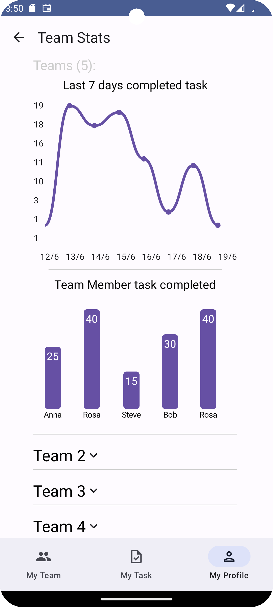

# MADLAB 2k24

### Login
When opening the mobile application, the first view showed is the login screen. The login with Google is performed by clicking on the button. If it is the first time the user enters the app, he is sent on the create profile to create its profile. On the other hand, he is sent to the "My Teams" screen.

### ShowProfile
In the showProfile screen, reached by the bottom bar, the informations about the profile are shown. In particular it is also possible to enter in the edit mode, to perform logout by clicking the button, or to enter the stats view

### EditProfile
In this screen, the user can edit its information

### MyStats / TeamStats
In these screens it is possible to see the personal statistics or the team statistics respectively

### My Tasks
In this screen, the list of personal tasks is shown, it is possible to apply some filter or to enter a single task view

### My Teams
In this screen, the list of personal teams is shown, it is possible to apply some filter or to enter a single team view

### New Team
Here, it is possible to add a team

### Team screen
In this screen the single team is shown. Here, it is possible to leave the team, enter the group chat, edit the team if the user is the admin of the team or to see informations or the team's tasks list. You can also navigate to the achievement screen. 

### Direct chat

### Achievement screen
Here, the achievements are shown. You can reclaim or see one of them

### Edit Team
In this screen is possible to edit the team

### New Task
Here, it is possible to add a task

### Task screen
In this screen the single task is shown. Here, it is possible to edit the task, to see informations or to add comments

### Filter Team / Task
Here it is possible to apply some filter to team or task respectively

